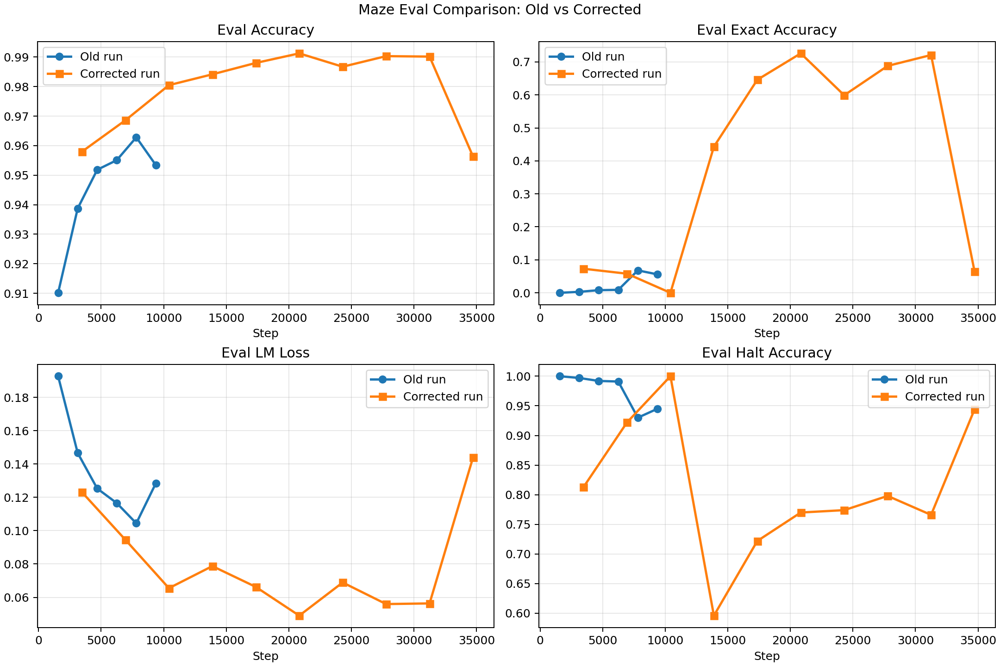
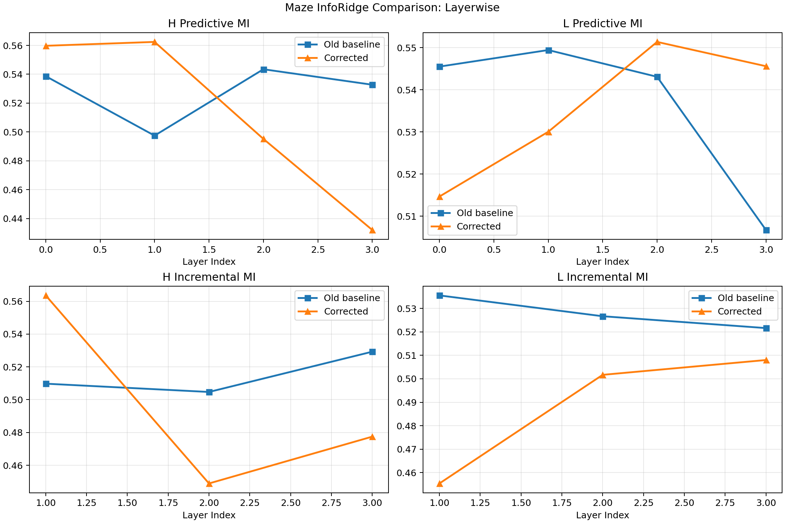
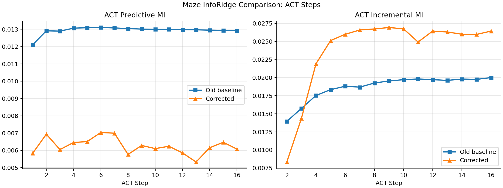
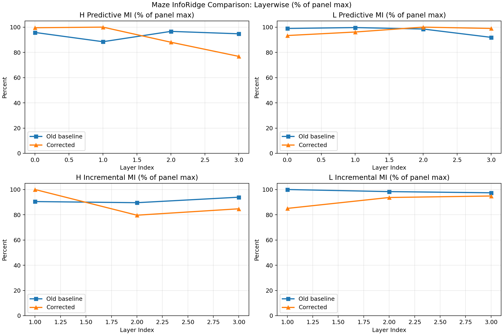
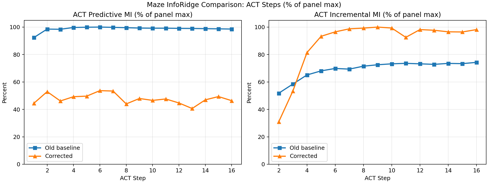

# Maze HRM: Old vs Corrected

This comparison was regenerated from the saved source CSVs after the comparison folder was removed.

## Selected Comparison Set

- `Old`: same old checkpoint, InfoRidge from `analysis/inforidge-step7810-fulltest/`
- `New-corrected`: corrected maze run, eval from `analysis/hrm-training-4090-6gpu-corrected/eval_metrics.csv`, InfoRidge from `analysis/inforidge-4090-6gpu-corrected-step20832/`

## Plots

These displayed InfoRidge plots use one old baseline plus the corrected run.

- `Old baseline` means the `Old-full` probe from `analysis/inforidge-step7810-fulltest/`
- `Old-small` is kept only as a saved artifact in the repo, not as a displayed comparison curve

## Percentage-Normalized InfoRidge Views

These two plots keep the same simplified baseline choice.

Each panel is scaled so that the strongest value in that panel across the shown runs is `100%`.

#